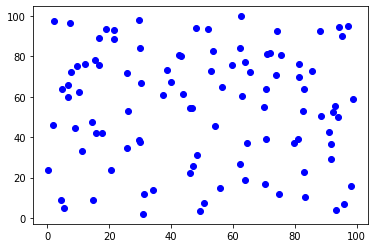

--- 
title: Stat 477
author: Richard Waterman
date: 6th May, 2020
---

## Title slide

In this slide I will say hello to you all

Here is some math $\sqrt{\pi}$


## A second slide
This one is beter and describes the goals.


```python
import pandas as pd
import numpy as np
import matplotlib.pyplot as plt

x = np.random.uniform(0,100,100)
y = np.random.uniform(0,100,100)
```

## The scatterplot


```python
plt.plot(x,y,'bo')
plt.show()
```




